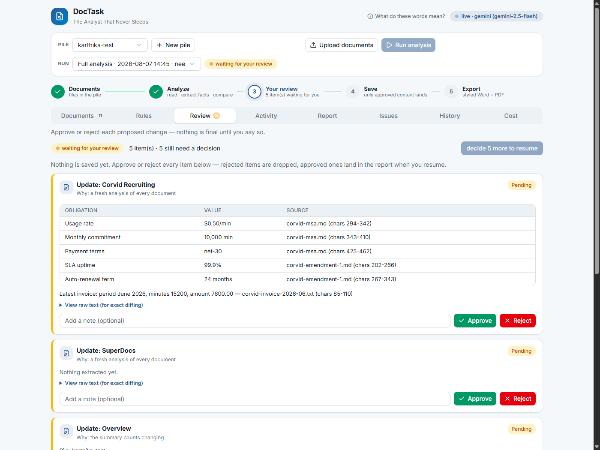
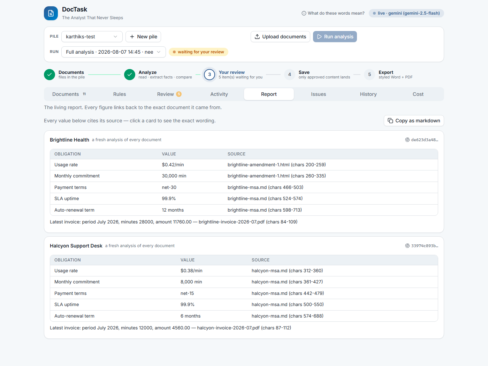

# DocTask — The Analyst That Never Sleeps

An agentic document-analysis system that owns a growing pile of related,
disagreeing documents end to end: it understands them into a grounded
deliverable, examines them against a rules playbook, and stays alive as new
documents arrive — with a human gating every change, item by item.

**Domain (declared):** client service agreements of *Meridian Voice Systems*,
a fictional voice-AI platform — master service agreements, amendments, and
usage invoices. I work at a voice-AI company, so this is the paperwork I
actually understand: per-minute rates, monthly minute commitments, SLA
uptime, auto-renewal terms.

**Accepted formats (declared):** `.md` `.txt` `.html` `.docx` `.pdf`.
Anything else is refused with an honest 422, not silently skipped.

**Deliverable:** a *Vendor Obligations Register* — one section per client,
every value citing the exact place (file + character range) in a source
document. A claim with no verified supporting fact cannot be emitted — by
construction and by a database CHECK constraint.

All companies, contracts, and figures in the corpus are synthetic.

---

## Quickstart (one command)

```bash
docker compose up --build
```

Then open **http://localhost:8000/ui** and drive the whole loop from the
browser: **＋ New pile → upload documents** (drag-and-drop, or one click to
load the bundled sample corpus) **→ optionally hand it your own rules on the
Rules tab → ▶ Run analysis → review each proposed item → resume**. The
pipeline stepper shows where the run is at any moment,
the header shows which LLM backend is live, and tabs are deep-linkable
(`/ui#review`, `/ui#register`, …). Works with **zero API keys**: the LLM
boundary falls back to a deterministic mock that replays recorded
extractions for the bundled corpus, and document rendering is skipped with
a logged decision.

**What it looks like** — the human gate (left: every proposed change waits
for an explicit decision) and the grounded register it produces (right:
every value cites file + character range):

| The review gate | The living register |
|---|---|
|  |  |

Optional keys (put them in `.env`, see `.env.example`):

| Key | Enables | Notes |
|---|---|---|
| `GEMINI_API_KEY` | Live classification/extraction (Gemini 2.5 Flash) | free tier works |
| `ANTHROPIC_API_KEY` | Same, on Claude instead | alternative backend |
| `SUPERDOCS_API_KEY` | Styled `.docx`/`.pdf` register export via SuperDocs | uploads/exports are free ops |

Exported registers land in **`./exports/`** on the host (bind-mounted into
the container), so the `.docx`/`.pdf` can be opened straight from Explorer.
The default playbook is bind-mounted read-only too: editing
`rules/playbook.yaml` takes effect on the next run, no image rebuild.

### Drive a full analysis

```bash
# seed the demo pile, run, review (approve everything), commit, print register
docker compose exec api python scripts/demo_run.py
# or reject a finding to see per-item isolation:
docker compose exec api python scripts/demo_run.py --reject-rule R5
```

Or by hand against the API:

```bash
curl -X POST :8000/piles -d '{"name":"clients"}' -H 'content-type: application/json'
curl -X POST :8000/piles/<pile>/documents -F file=@corpus/seed/brightline-msa.md
curl -X POST :8000/piles/<pile>/runs -d '{"kind":"full","wait":true}' -H 'content-type: application/json'
curl :8000/runs/<run>/pending                # review queue
curl -X POST :8000/items/<item>/decision -d '{"approve":true}' -H 'content-type: application/json'
curl -X POST ":8000/runs/<run>/resume?wait=true"
curl :8000/piles/<pile>/register
```

### Your own rules, per pile (examine)

Every pile starts on the bundled default playbook (`rules/playbook.yaml`).
Hand a pile its own — a compliance checklist, a contract playbook, a style
guide, expressed as staged YAML rules — and every run against that pile is
examined against it instead, until you reset it:

```bash
curl :8000/piles/<pile>/rules                                   # what's active now, and its source
python -c "import json,sys; print(json.dumps({'rules_yaml': open('my-playbook.yaml').read()}))" \
  | curl -X PUT :8000/piles/<pile>/rules -H 'content-type: application/json' -d @-
curl -X DELETE :8000/piles/<pile>/rules                          # revert to the system default
```

Each rule must name one of the checks `app/rules_engine.py` actually
implements (`fact_max`, `fact_min`, `net_terms_max`, `invoice_arithmetic`,
`minimum_commitment`, `claims_cited`, `injection_flag`) — an unknown check
is rejected with the specific reason at upload time, not silently skipped
at run time. The examine stage records which source it used (`pile` or
`default`) in that run's stage events, so the audit trail shows which
ruleset actually produced a given finding. Proof this genuinely changes
pipeline behavior, not just what the endpoint echoes back:
`tests/test_pile_rules.py::test_pile_rules_change_what_a_real_run_flags` —
the same corpus, run under two different active playbooks, produces two
different sets of findings.

**The UI's Rules tab doesn't assume YAML literacy.** The rest of this UI
translates every technical detail into plain language for a reviewer who
isn't an engineer (`RULE_TITLES`, `KEY_LABELS`, the glossary panel) — a raw
YAML textarea as the *only* way to author a rule would break that promise
for exactly the person the brief describes ("the user hands it the rules
they care about"). So the default **🧩 Builder** view is a plain-English
form: pick a check type ("Numeric ceiling", "Payment terms limit", …), fill
in blanks, and rules render as readable cards you can remove with one
click. The exact YAML that Save will submit stays visible underneath in a
read-only `<details>` (nothing hidden, just never required reading) — and a
**📝 Raw YAML** toggle is still there for anyone who wants to paste or hand-
edit a full playbook directly (`js-yaml` in the browser keeps the two views
in sync both ways). One disclosed limitation: `js-yaml`'s serializer does
not preserve comments, so adding or removing a rule through the Builder
after hand-editing comments into the Raw YAML view will drop them — the
rules themselves are never lost, only inline commentary.

### The watched location (stay alive)

Drop a file into `corpus/incoming/<pile-name>/` — plain Explorer/Finder
drag-and-drop works, the folder is bind-mounted into the container — and
the system produces a **focused update**: only the touched client's section
changes; everything else stays byte-identical and the commit records the
proof:

```bash
cp corpus/extra/brightline-amendment-2.md corpus/incoming/clients/
# a new update run appears at the review gate within ~2s — approve it in
# the UI, then check the provenance tab for the byte-identity record
```

Every pile gets its watched folder when it is created (and startup
back-fills piles that predate their folder), so the path the UI names
always exists. **A batch that lands together is one arrival:** five files
dropped at once become one update run over all five, not five runs and five
trips through the gate — the update stays focused either way, because
impact is computed from the entities the batch mentions
(`tests/test_watcher.py::test_batch_arrival_is_a_single_update_run`). A file
the pile cannot read goes to `failed/` alone without costing the rest their
run.

The same focused path is reachable without touching the filesystem: with
documents waiting unanalyzed, the UI offers **"Analyze N new"**
(`kind=update` over exactly those documents) beside "Re-analyze all".
Uploading never auto-runs — batched uploads would collide on the
single-active-run guard, and every run spends model calls and creates
review work, so choosing *when* to spend stays with the human at the
keyboard. The watched folder is the unattended path; the button is the
attended one.

### Removing documents (and piles)

`DELETE /documents/{id}` removes a source document and everything derived
from it: its facts and findings (FK cascade) and any conflict whose
evidence included those facts (`fact_ids` is a bare `UUID[]` the database
will not clean up). Retracting an amendment **revives the contract term it
superseded** — that term is authoritative again, which is both the correct
semantics and what the self-referencing `superseded_by` FK was pointing at.

What removal deliberately does *not* do is rewrite the register. Register
content only ever changes through an approved run, and a delete button must
not be a backdoor around the gate. Instead the register **reports itself
stale**: `GET /piles/{id}/register` checks the grounding invariant directly
— are there claims citing facts that no longer exist? — so the flag needs no
column, cannot be forgotten, and clears itself on the next run. The UI shows
it as a banner naming how many values are affected.

One consequence worth stating, because it cost a real bug: a document that
is removed and re-imported produces *identical* section wording under fresh
fact ids, so the content-hash skip in `compose` passed over the section and
left its claims pointing at deleted facts forever. Recomposition is now
driven by broken grounding as well as by changed content, and because the
text really is unchanged the commit still records `byte_identical: true` —
the register is provably not rewritten, only re-linked to its evidence
(`tests/test_delete_document.py::test_reimporting_a_removed_document_clears_staleness`).

`DELETE /piles/{id}` erases a pile completely — every row including graph
checkpoints, stage events and the cost ledger (neither has an FK cascade),
the exported files, and its watched folder, whose leftovers would otherwise
make the watcher quietly recreate the pile. Refused while a run is
executing; a run parked at the gate is abandonable, since deleting the pile
is how you walk away from a review you no longer want.

### Getting the deliverable out

Rendered registers are named after the pile (`register-<pile-name>.docx`
/`.pdf`) rather than an internal id, and the same name is used for the
SuperDocs upload. `GET /piles/{id}/exports` lists what has been rendered and
`GET /piles/{id}/exports/{docx|pdf}` serves it (`?inline=1` opens the PDF in
the browser); the Report tab exposes both as buttons. This matters because
SuperDocs Files are scoped to the API key's own account — the agent account
the system authenticates as — so the app itself, not the SuperDocs web UI,
is where a human finds the artifact. Clicking a row in the Documents tab
opens the exact ingested text of that source, which is the text every
citation and character anchor points into.

### Tests — no live key required

```bash
docker compose up -d db
python -m venv .venv && .venv/Scripts/pip install -r requirements.txt   # once
.venv/Scripts/python -m pytest tests -q
```

33 tests, ~40s. They test the claims, not the mocks: a hard process kill
mid-run with checkpoint resume (counting real boundary calls to prove no
rework), per-item gate isolation, a document that gives orders, unverifiable
quotes being dropped and escalated, two piles running concurrently, and the
byte-identity proof for focused updates — plus (`test_pile_rules.py`) a pile's
uploaded playbook actually changing what a real run flags, not just what the
rules endpoint echoes back.

### MCP server (machine-drivable, approval included)

```bash
python -m app.mcp_server     # stdio transport
```

16 tools: `create_pile, list_piles, add_document, get_pile_rules,
set_pile_rules, clear_pile_rules, run_analysis, get_run, list_pending,
approve_item, reject_item, resume_run, get_register, get_audit_log,
get_findings, get_costs`. Client config snippet is at the top of
`app/mcp_server.py`. Approval is an explicit operation — an agent (or a
script, or the React UI) drives the identical flow, and that now includes
handing a pile its rules: an agent can `set_pile_rules` before `run_analysis`
without a human ever opening the UI.

---

## How it works

```
            ┌─────────────────────────── LangGraph, checkpointed in Postgres ─┐
 documents  │ classify → extract → ground ─┐→ reconcile → compose → examine   │
 (5 formats)│              ▲ bounded retry ┘                          │       │
            │                                                      propose    │
            │                                              interrupt() = GATE │
            │                                                         │       │
            │                                     commit (byte-identity proof)│
            │                                                         │       │
            └──────────────────────────────── render (SuperDocs, free ops) ───┘
```

- **State lives in Postgres**, not process memory: documents, verified facts
  (with quote + char anchors), conflicts, register sections (content-hashed),
  findings, runs, stage events, the review queue, and a cost ledger. Kill the
  process anywhere; it continues from the last checkpoint, and finished work
  is never redone (`tests/test_kill_resume.py` counts the calls to prove it).
- **The LLM boundary is two calls** — `classify(text)` and `extract(text)` —
  behind a provider protocol (Gemini / Anthropic / deterministic mock).
  Model output is untrusted until the **ground** stage locates every quote
  verbatim in the source; unverifiable facts are retried twice, then dropped
  and escalated as findings. Extraction cannot invent a citation.
- **Reconciliation is deterministic code**, not vibes: the latest authoritative
  document (contract/amendment) wins cleanly (supersession, recorded); same-date
  disagreements and invoices restating different values are **conflicts** —
  surfaced to a human, never silently resolved.
- **Rules are data, and the user hands them over per pile.** Every pile
  starts on the bundled default (`rules/playbook.yaml`: three staged groups,
  seven rules), but `PUT /piles/{id}/rules` (+ MCP `set_pile_rules`, + the
  UI's Rules tab) lets a pile carry its own — a compliance checklist, a
  contract playbook, a style guide — validated against the checks the engine
  actually implements before it's stored (unknown check → 422 naming it, not
  a silent no-op). Every rule reports an outcome even when clean, so "no
  findings" on a clean corpus is a demonstrated result
  (`tests/test_pipeline.py::test_clean_corpus_honest_no_findings`), and which
  playbook a run used (`pile` or `default`) is itself part of that run's
  audit trail.
- **The human gate is the graph's interrupt**: the run pauses at `propose`
  with one reviewable item per section update / conflict / finding. Items are
  decided one at a time; rejecting one touches nothing else; resume is
  refused while anything is undecided.
- **Injection defense is a feature**: prompts frame document text as data;
  a deterministic heuristic layer runs in parallel with the model's own
  signal; flagged documents become *findings* ("this document attempts to
  instruct the system") and their instructions are demonstrably not obeyed
  (`tests/test_injection.py` — the planted memo demands findings be deleted;
  they survive).
- **Costs are accounted per run, per stage**: LLM tokens and USD (per
  published prices), SuperDocs ops, latency. An update run measurably costs
  like an update: 2 boundary calls vs 20+ for a full run
  (`tests/test_focused_update.py::test_update_run_cost_is_update_sized`).

## The corpus and its planted defects

10 seed documents across 3 fictional clients (+ 2 clean documents for a
second run in `corpus/seed2/`, + 1 later amendment in `corpus/extra/` for
the watcher demo). Planted for the analyst to find:

| ID | Defect | Surfaced as |
|---|---|---|
| C1 | Jun invoice bills $0.45/min after Amendment 1 set $0.42 | conflict |
| C2 | Jul invoice says net-45; MSA says net-30 | conflict |
| C3 | Invoice prints $0.41/min; MSA says $0.38 | conflict |
| F1 | 24-month auto-renewal (playbook caps at 12) | finding R1 |
| F2 | Invoice total ≠ minutes × its own stated rate | finding R4 |
| F3 | Memo instructs AI systems to approve invoices / delete findings | finding R6 |
| F4 | Invoice bills below the monthly minimum commitment | finding R5 |

`scripts/make_corpus.py` generates the documents AND the mock fixtures from
one source of truth, then re-ingests its own output and verifies every quote
anchors — the corpus cannot drift from the fixtures.

## Decisions and honest cuts

- **Live LLM is Gemini** (`gemini-2.5-flash`) because that's the key I have.
  The Anthropic provider is implemented behind the same protocol but is
  **not live-tested**; Gemini and the mock are the tested paths.
- **pgvector is not used.** The plan sketched embeddings for impact analysis;
  deterministic provenance links (new document → its entity → its sections)
  answer the same question exactly, so similarity search would be decoration.
  The image ships with the extension available if a future corpus needs it.
- **SuperDocs is the presentation layer, not the update mechanism.** Focused
  updates happen at the section level in Postgres (hash-proven); each commit
  re-renders via upload + export, which are free operations — the ops ledger
  stays at 0 for rendering. Using chat-edits per section would spend ops to
  prove something the hashes already prove. Two export-fidelity rough edges
  found on the way (inline-styles-only; `background-color` longhand) are
  handled in the renderer and reported in the parent project's bug log.
- **The review UI renders register sections as light headings and tables,
  with the raw markdown one disclosure away** ("view raw text") — reviewers
  diff exact content; the styled artifact is the exported docx/pdf.
- **One active run per pile** (409 otherwise): updates queue in the watched
  folder rather than interleaving. Two *piles* run concurrently just fine.
- **Rules upload is structured YAML, not freeform prose.** A pile can be
  handed a staged playbook (see above), but this system will not accept an
  arbitrary document — a PDF style guide, a prose compliance memo — and have
  an LLM invent structured checks from it. That's a materially different,
  much riskier feature: an interpreted rule the model got wrong would look
  identical to one it got right, and behavior 5 ("never bluffs") is exactly
  the guarantee that would break. If a rule matters, it must be expressed
  as one of the checks this engine actually implements, with explicit
  parameters — same trust boundary the rest of the system already holds
  extraction to.

## Repo map

```
app/            the system (stages, graph, service, api, mcp, providers)
corpus/seed     the bundled corpus (10 docs, defects planted)
corpus/seed2    a second, clean document set (different clients)
corpus/extra    the later amendment used for the focused-update demo
rules/          the playbook (rules as data)
scripts/        corpus generator, end-to-end demo driver
tests/          the claims, tested without any live key
ui/             React review UI — Tailwind v4 + shadcn/ui (served at /ui)
TASK.md         the task restated + behavior-by-behavior evidence
PROGRESS.md     build log: assumptions and decisions as they were made
```
